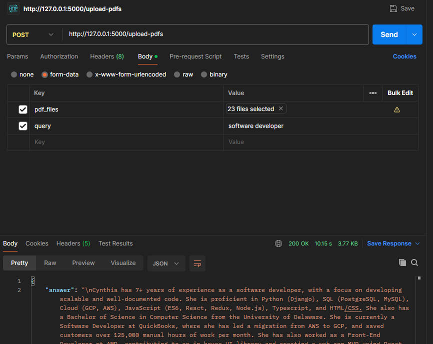

# Langchain Resume Scan with OpenAI


## Getting Started

These instructions will get you a copy of the project up and running on your local machine for development and testing purposes.

### Prerequisites

What things you need to install the software and how to install them:

- Git
- Docker

You can download and install Git from [git-scm.com](https://git-scm.com/), and Docker from [docker.com/products/docker-desktop](https://www.docker.com/products/docker-desktop/)

### Installation

A step by step series of examples that tell you how to get a development env running:

1. Clone the repository

```bash
git clone https://github.com/axim1/virai.git
```
2. Add openai api key in the env file
OPENAI_API_KEY='ApiKey'

3. Start the application locally
```
docker build -t my-flask-app .
docker run -p 5000:5000 my-flask-app
```

### Postman Example



There are some example files in "resume files" folder